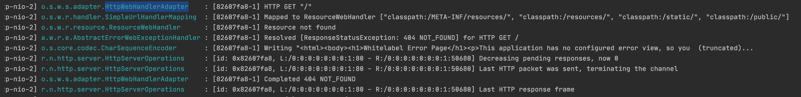

# 工程简介
 电商路由实现
# gateway路由功能学习
## 概念 
Spring Cloud Gateway旨在提供一种简单而有效的方式来对API进行路由，并为他们提供切面，
例如：服务动态路由/服务统一限流熔断/统一授权认证/服务统一性能监控/统一会读发布

## 原理：
 客户端发起请求到gateway，由Gatewayd的Handler Mapping确定请求与路由是否匹配，
 如果匹配则将请求发送到Gateway的Web Handler。此handler通过与该请求相关的过滤器链来处理请求，
 根据过滤链配置处理请求与响应结果，其中过滤链分为前置处理(转发请求前处理)，后置处理(转发请求后处理)

## gateway组成部分：
   Route路由：它由ID、目标URI、断言集合和过滤器集合组成。如果集合断言结果为真，则匹配到该路由  
   Predicate断言: 可以通过它匹配来自http的任何内容如，如：如Header或参数  
   Filter 过滤器： 可以在返回请求之前或之后修改请求和响应的内容，是FrameworkGatewayFilter实例  

#### 服务的统一路由是通过Predicate断言实现的 
   断言种类如下:  
      After 在指定时间之后/Before 在指定时间之前/Between 在指定时间之间  
      Path指定请求路径开始的  
      Cookie /Query 请求参数/RemoteAddr 匹配客户端ip地址来访问指定服务  
      Header 指定头的/Host 指定域名的/Method 指定请求方式  
      Weight 简单的负载均衡策略，通过它可以配置指定服务的权重(实际使用中可以使用功能更加强大的Ribbon代替)   
   断言具体使用方式：[官网地址](https://cloud.spring.io/spring-cloud-gateway/reference/html/#gateway-request-predicates-factories)  
#### 服务的统一路由可以通过过滤器添加、删除、修改head参数/请求参数 requestBody
   Filter 过滤器:
       AddRequestHeader/AddRequestParameter/AddResponseHeader 
       RemoveRequestHeader/RemoveRequestParameter/RemoveResponseHeader
       MapRequestHeader  官方文档介绍可以改变header参数名字给下游使用，如A携带header参数为abo-test:hello world访问网关，到下游可以修改为admin-test:hellow world  
       DedupeResponseHeader  可以解决跨域问题  
       CircuitBreaker  断路器/熔断限流器 需要与spring-cloud-starter-circuitbreaker-reactor-resilience4j结合使用  
       FallbackHeaders  与CircuitBreaker一起使用，当限流器件出现异常时候会调用它
       PrefixPath  给下游请求路径上加上前缀路径如 /demo/** 请求转发到 /admin/demo/**
       PreserveHostHeader  保留原始host值 默认为gateway值
       RequestRateLimiter  限流器 可以结合redis使用
       RewritePath  
       RewriteLocationResponseHeader  
       RewriteResponseHeader  
       SaveSession  
       SetPath  
       SetStatus  
       StripPrefix  与PrefixPath相对 是将请求路径减少 如/admin/demo/test变成 /test
       Retry  
       RequestSize  限制请求体大小 maxSize(大小) DataUnit(单位)
       SetRequestHost  
       ModifyResponseBody  
       ModifyRequestBody  
   
   
 源码解读
  修改日志级别为debug，可以看到请求入口为 HttpWebHandlerAdapter方法，如下图
  
  
  
  待整理
  HttpWebHandlerAdapter.handle 方法首先会调用createExchange方法生成DefaultServerWebExchange，
  并且初始化其中参数request,response,session,localeContextResolver(多语音解释器),
  formDataMono(form表单参数)与(multipartDataMono)上传的文件,applicationContext上下文
  
  
 
 

# 延伸阅读
CloudFoundryRouteService

参考资料：

